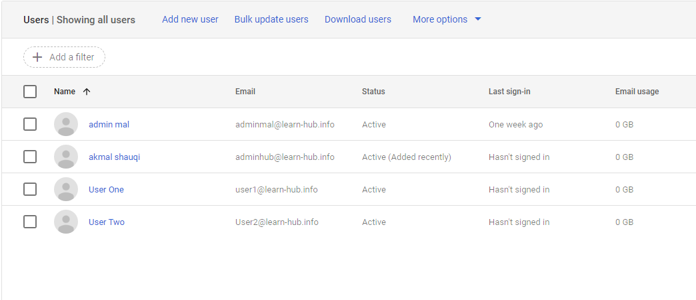
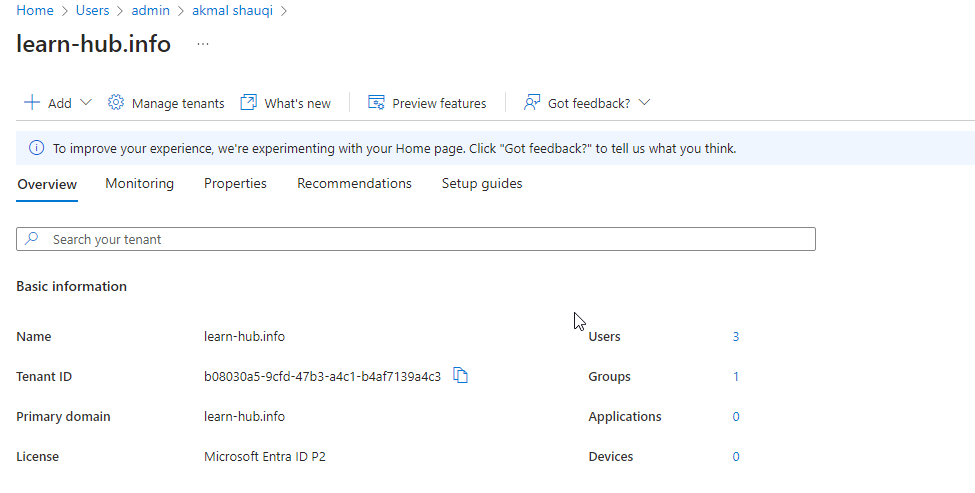
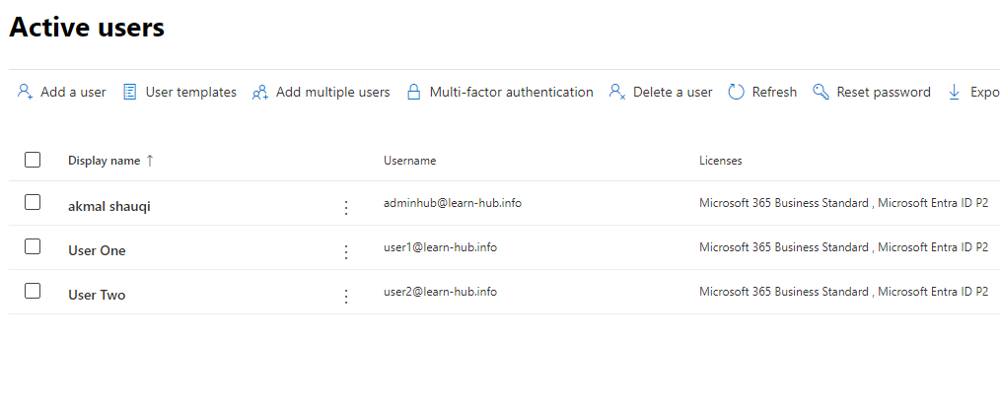
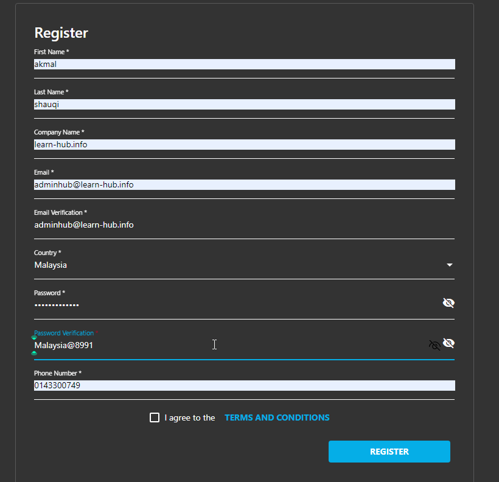
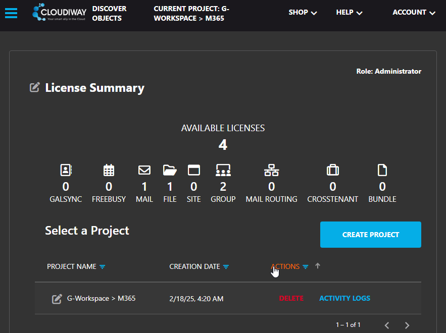
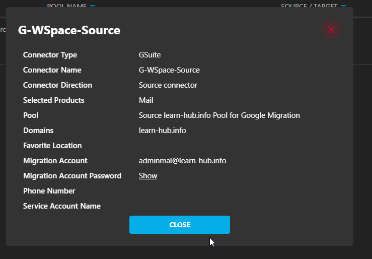
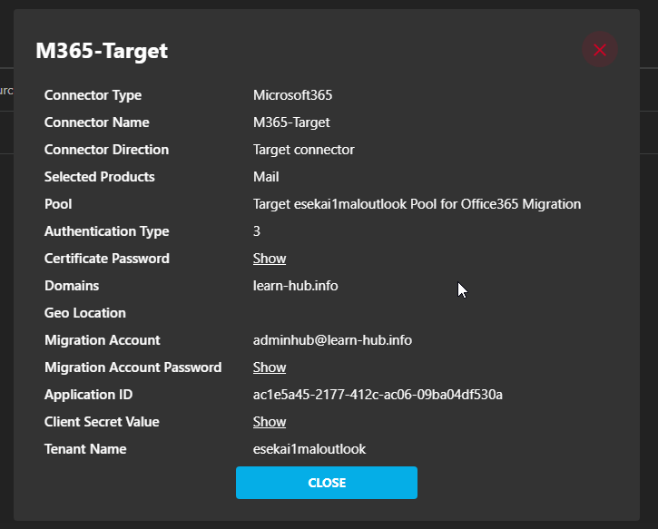
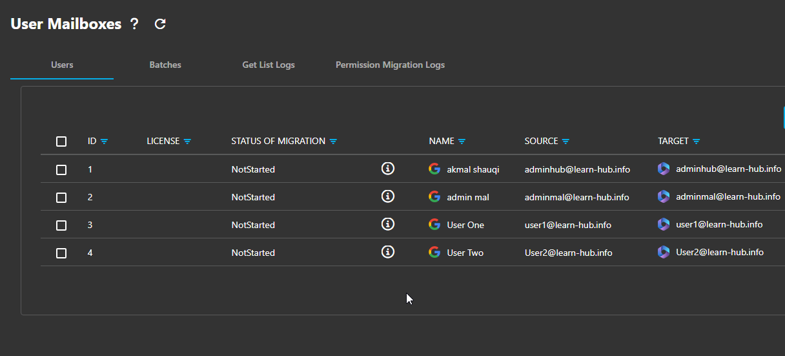
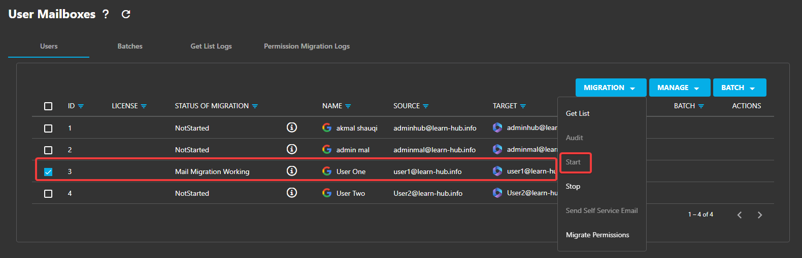
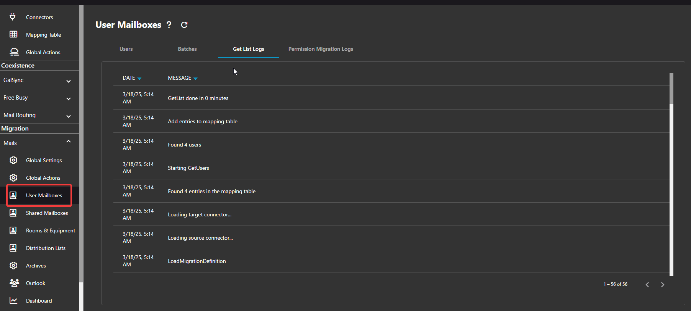

public:: true

- #Lab
- # **1. Setting Up the Google Workspace (Source) Environment**
	- ## **Step 1.1: Sign Up for a Google Workspace Trial**
		- Open [Google Workspace Free Trial](https://workspace.google.com/).
		- Click **Get Started** and provide the following details:
			- **Business Name**: Enter any test name (e.g., "TestLab Inc.").
			- **Number of Employees**: Choose **Just you** or **2-9 employees**.
			- **Region**: Select your country.
		- Click **Next** and enter a **Test Admin Email** (e.g., `adminmal@learn-hub.info`).
		- Create a **Google Workspace Admin Account** with:
			- **Username**: `adminmal@learn-hub.info`
			- **Password**: P@ssw0rd.
			  
			  **Test-Out the workspace**.
			  
			  ---
	- ## **Step 1.2: Create Test Users & Groups**
		- In **Google Admin Console**, go to **Directory → Users**.
		- Click **Add User** and create at least **3 test users**, for example:
			- **User 1**: `adminhub@learn-hub.info`
			- **User 2**: `user1@learn-hub.info`
			- **User 3**: `user2@learn-hub.info`
		- Click **Save** and repeat for each user.
		  
		  📸 **Screenshot Tip** 
		   
		  
		  ---
	- ## **Step 1.3: Enable Google Drive, Gmail, and Google Sites**
		- In Google Admin, go to **Apps → Google Workspace**.
		- Ensure the following services are **enabled**:
			- **Gmail** (for email migration).
			- **Drive and Docs** (for file migration).
			- **Google Sites** (if testing site migration).
		- Click **Save**.
- # **2. Setting Up the Microsoft 365 (Destination) Environment**
	- ## **Step 2.1: Get a Free Microsoft 365 Test Environment**
		- Choose **Microsoft 365 any free trial subscription** (includes Exchange, SharePoint, and OneDrive).
		- Provide test tenant details:
			- **Tenant Name**: Choose a test domain (e.g., `learn-hub.info`).
			- **Admin Username**: `adminhub@learn-hub.info`.
			- **Admin Password**: Malaysia@8991.
	- 📸 **Screenshot**:
	  
	- ---
	- ## **Step 2.2: Create Test Users in Microsoft 365**
		- Log into the **Microsoft 365 Admin Center** ([admin.microsoft.com](https://admin.microsoft.com)).
		- Go to **Users → Active Users** → Click **Add User**.
		- Create at least **3 test users**, matching Google users:
			- **User 1**: `user1@learn-hub.info`
			- **User 2**: `user2@learn-hub.info`
			- **User 3**: (`adminhub@learn-hub.info`, **GlobalAdmin**)
		- Assign each user an **Exchange Online, SharePoint, and OneDrive license**.
		- Click **Save**.
		  
		  📸 **Screenshot**:
		   
		  
		  ---
- # **3. Register for Cloudiway Free Trial**
	- ## **Step 3.1: Sign Up for Cloudiway**
		- Open [Cloudiway Migration](https://cloudiway.com/).
		- Click **Free Trial** → Enter your details and create an account.
		  
		- Log into **Cloudiway Admin Panel**.
		  
		  📸 **Screenshot**:
		   
		  
		  ---
- # **4. Configure API Access/Connector (Google & Microsoft) In Cloudiway**
	- ## **Step 4.1: Set Up Connector Source & Target**
		- 
		- 
		- 
	- ## **Step 4.2: Set Up Microsoft API Access for Cloudiway**
		- Open [Azure Portal](https://portal.azure.com).
		- Go to **Azure Active Directory → App Registrations** → Click **New Registration**.
		- Set:
			- **Name**: CloudiwayMigration
			- **Supported Account Type**: Single Tenant
			- **Redirect URI**: Copy from Cloudiway settings.
		- Click **Register** → Go to **Certificates & Secrets** → **New Client Secret**.
		- Copy **Client ID & Secret** and enter them in Cloudiway.
- # **5. Perform the Migration Tests**
	- ## **Step 5.1: Email Migration (Gmail → Exchange Online)**
		- In Cloudiway, go to **User Mailbox → Select Single User / Create a Batch 4 Multiple Users**.
		- Select:
			- **User 1**: `user1@learn-hub.info`
			- Click the **Migration** Tab > Dropdown select **Start**
			  
		- Click **Start Migration**.
		- For logs:
		  
- Link & Reference
	- [How To Get Google Feeds: Configure Your Google Connector](https://help.cloudiway.com/article/g-suite-connector-configuration/)
	- [App-only authentication in Exchange Online PowerShell and Security & Compliance PowerShell | Microsoft Learn](https://learn.microsoft.com/en-us/powershell/exchange/app-only-auth-powershell-v2?view=exchange-ps#assign-microsoft-entra-roles-to-the-application)